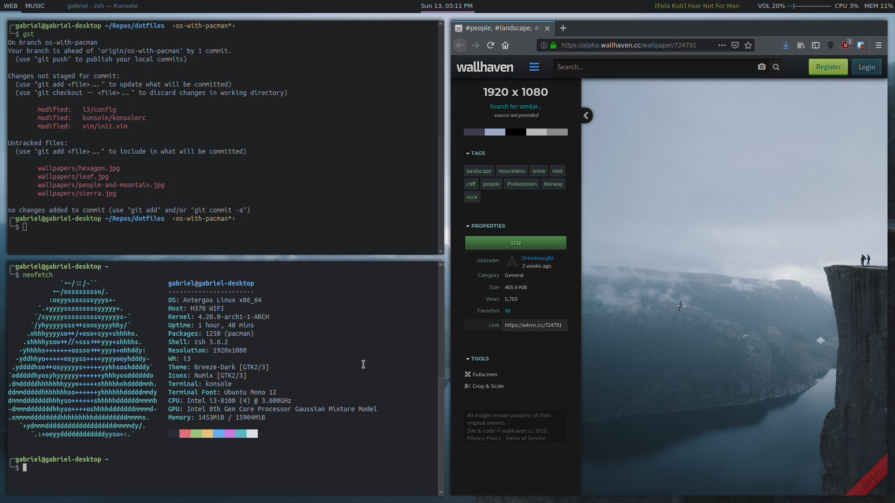
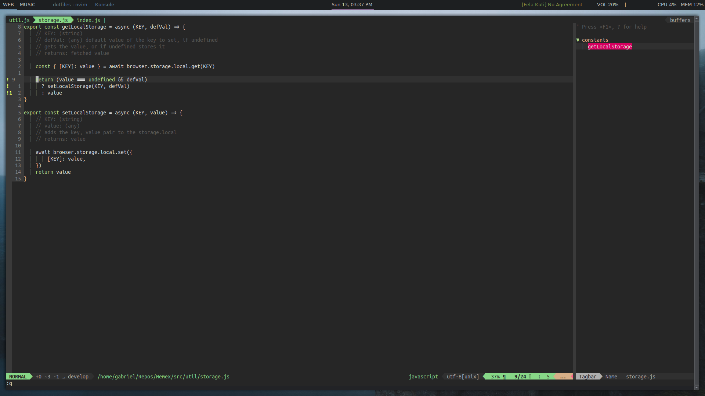

```
      _       _    __ _ _           
   __| | ___ | |_ / _(_) | ___  ___ 
  / _` |/ _ \| __| |_| | |/ _ \/ __|
 | (_| | (_) | |_|  _| | |  __/\__ \
  \__,_|\___/ \__|_| |_|_|\___||___/
                                    
```

Configuration files for my desktop. The ideia is to not only version them but also to make it easy to set up a completely new desktop. Hence, the always up-to-date `install.sh` script that does almost all of the work.

## Components

- Antergos OS
- i3-gaps as window manager
- Polybar
- Compton, to make the workspace transitions smooth and give the inactive windows some transparency.
- Konsole, mainly because of the font ligature support
- ZSH with oh-my-zsh
- FZF
- RipGrep
- Neovim, but sometimes Emacs with Evil mode too

## Disclaimer

First of all, the `install.sh` script **DELETES YOUR DOTFILES** so it can create symbolic links after. Back them up first if you want to use the installation script.

## Installation

1. Backup your configuration files.
2. Go to the repository's root folder.
2. Run ` bash install.sh`.

## Thanks

- [flumm/Themes](https://github.com/flumm/Themes): Color patterns, Polybar configs and inspiration
- 

## Screenshots





